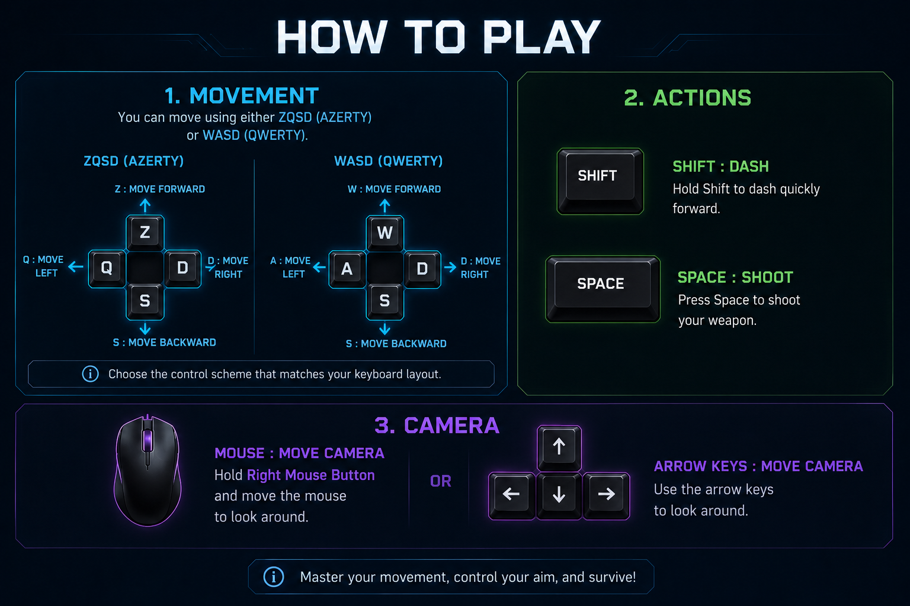

# TANK SURVIVAL

**Master 1 - Computer Science - Université Côte d'Azur - 2025-2026**

## Group
Group members: 

- EL JAGHAOUI Abdelhafid
- BACHA Hiba

## Gameplay Screenshot 


## The game is available at:

## [🎮 Play the game](https://hafid-06.itch.io/tank-survival)

## Gameplay Video

## [🎥 Watch the video](https://www.youtube.com/watch?v=UisMbdh2TcE)

## Development Story & Team

Hi! We are Abdelhafid and Hiba, Master 1 Computer Science students at Université Côte d'Azur. Building *Tank Survival* was an intense but incredibly rewarding journey for both of us. We didn't just want to create a game; we wanted to build an experience where the environment felt truly reactive. We are really proud of what we've built, and we hope you have as much fun playing it as we had developing it.

## Prerequisites (to run locally)

- Node.js (v18 or higher)
- A modern browser with WebGL2 support (Chrome, Firefox, Edge)

## How to run the game locally: 

- `git clone https://github.com/gamesonweb/ia-edition-tank-survival.git`

- Navigate to the project directory: `cd ia-edition-tank-survival`

- `npm install`

- `npm run dev`

- Then open the link shown in your terminal (usually `http://localhost:5173/`)

## Project Structure

```text
Tank_Survival/
├── public/          # Static assets (3D models, music, textures).
├── src/
│   ├── main.js          # Entry point: Initializes the engine and render loop.
│   ├── scene.js         # Orchestrator: Connects modules and manages game logic.
│   ├── gameState.js     # Data: Centralizes score, lives, and game states.
│   ├── audioManager.js  # Audio: Manages loading and playing of all sounds.
│   ├── environment.js   # 3D Universe: Creates lights, sky, ground, and obstacles.
│   ├── particles.js     # Visual effects: Manages explosions and particles.
│   └── ui.js            # Interface: Displays the HUD, menus, shop, and buttons.
│   └── ally.js          # Ally: Manages the allied tank behavior and logic.
├── index.html       # Main page: Contains the game canvas (display area).
└── package.json     # Configuration: Lists dependencies (Babylon.js, Vite) and scripts.
```
    
## Description

*Tank Survival* is an intense, arcade-style survival game where you take control of a tank. 
Your mission is: hold your ground against endless waves of zombies. 
As you defeat enemies, you collect coins to buy permanent upgrades and unlock new types of ammunition. 
Keep an eye out for bonuses that appear on the map to help you in the heat of battle! 
The difficulty increases as you progress, forcing you to stay sharp, manage your resources, and keep moving.

### Theme: IA Edition

We developed this game for the GamesOnWeb "IA Edition" challenge. Our goal was to make AI the heart of the gameplay, rather than just a way to control enemies. We built a "Game Director" that adjusts the challenge in real-time, created zombies that react to your movements using smart logic, and added an autonomous ally tank to fight by your side. 

### Know Your Enemies

You aren't just fighting one type of zombie. The horde evolves as you survive, introducing new challenges:

* **Rusher (Wave 1):** The standard zombie.
* **Flanker (Wave 3):** Smarter than the average zombie; moves in unpredictable patterns to surround you.
* **Charger / Boss (Wave 5):** A heavy-hitting mini-boss with a large health pool. Keep your distance!
* **Spitter (Wave 5):** A tactical threat; stays at a distance and launches acidic projectiles at your tank.
* **Kamikaze (Wave 7):** An explosive threat; moves at high speed and detonates on impact. Do not let them touch you!

## Shop & Power-ups

To survive longer, you’ll need to manage your resources wisely. Here is how you can boost your tank's potential during a run.

### Map Bonuses
Keep an eye out for crates that randomly appear on the map during your survival run:
* 🟨 **Machine Gun:** Drastically increases your fire rate for a short time.
* 🟥 **Life +1:** Adds one extra life.
* 🟦 **Freeze:** Temporarily stops all zombies in their tracks.
* 🟪 **Max Speed:** Gives you a temporary movement speed boost.

### Weapons & Allies (Shop)
Collect coins by defeating zombies and spend them in the shop to upgrade your arsenal:

| Item | Cost | Description |
| :--- | :--- | :--- |
| **SMG** | 10 coins | High fire rate, perfect for thinning out hordes. |
| **Missile** | 30 coins | Explosive rounds with Area-of-Effect (AoE) damage. |
| **Heavy Cannon** | 50 coins | Massive damage with a larger explosive radius. |
| **Ally Tank** | 100 coins | Your own autonomous partner that fights by your side. |

## Controls

**This game is fully playable on both desktop computers and laptops (works perfectly with either a mouse or a trackpad).**



- Movement: ZQSD or WASD
- Camera: Right click + drag OR Arrow keys
- Shoot: Space
- Dash: Shift
- Pause: Esc

## Objective

Eliminate as many zombies as possible to get the highest score and collect coins to buy upgrades.

## Tester Mode

We want everyone to be able to test the game mechanics easily. That's why we included a "Tester Mode." This mode gives you 500 coins, 5 lives, and all bullet types unlocked right from the start. It's perfect if you want to dive straight into the action and test out our upgrade system or enemy behavior without the grind.

## Gameplay & Intelligence

You might notice that the enemies in this game behave in clever, reactive ways, that’s the "Game AI" working behind the scenes.
We use these techniques as a tool to make the gameplay lively and fun. Here is how we leverage system logic to fit our AI theme. :
* **Behavioral FSM:** Enemies operate with state-based logic, switching seamlessly between patrolling, pursuing, and attacking based on your current position.
* **The 'Game Director':** The game doesn't just spawn enemies randomly. It tracks your wave count and score to dynamically scale the difficulty and introduce tougher enemy types (like Bosses, Kamikazes or Spitters) as you progress.
* **Tactical Combat:** Every enemy type has a specific personality. 'Spitters' (projectile zombies) are programmed to maintain distance, 'Kamikazes' use "rush-down" logic to close the gap, and some enemies even perform **dynamic evasive maneuvers** to dodge incoming fire, making them harder to hit.
* **Navigation & Obstacle Avoidance:** Enemies don't just walk blindly into walls; they use real-time checks to navigate around obstacles and maintain their orientation toward their targets.
* **Autonomous Ally:** The allied tank isn't just a static object. It features its own target-prioritization logic to actively help you survive in the heat of battle.


## Our Challenges

Building *Tank Survival* was an intense but incredibly rewarding journey for both of us. We didn't just want to create a game; we wanted to build an experience where the environment felt truly reactive.

* **The "Game Director"**: One of our main challenges was creating a dynamic enemy management system. The "Game Director" doesn't just spawn zombies randomly; it analyzes the wave level, the player's score, and health in real-time to adjust the difficulty. This system allows for the gradual introduction of tactical threats (like Spitters) or brute force enemies (like Kamikazes), ensuring the difficulty progression feels natural and balanced. Balancing the spawning logic to create a consistent challenge was a constant back-and-forth.

* **Hitbox Calibration**: We spent a significant amount of time manually fine-tuning the collision zones for every enemy and decor element. This phase of repetitive testing was crucial to achieving precise gameplay, where every shot and physical interaction perfectly matches the visual model. It was a tedious process of trial and error, but ensuring that the physical collision felt precise and natural was essential for the game to feel satisfying.

* **Ally Behavior**: Developing the autonomous ally's intelligence was complex. It had to act as an intelligent partner capable of prioritizing dangerous targets and navigating the environment without blocking the player's path. Getting it to feel like a helpful partner rather than just another obstacle on the map took way more iteration than we initially expected. One of our biggest achievements and sources of pride was making the ally feel truly useful and natural during gameplay, almost like a real teammate helping the player survive.

* **Deployment Optimization**: Hosting the game was a technical trial. Our large 3D models made the game run very slowly on GitHub Pages. When moving to Vercel, we encountered file size limits. We resolved these issues by manually optimizing and compressing our GLB assets, which allowed us to maintain high visual fidelity while ensuring optimal gameplay fluidity for users.

We are really proud of what we've built, and we hope you have as much fun playing it as we had developing it.

## Tech Stack

* Engine: Babylon.js

* Build Tool: Vite

* Language: JavaScript (ES6+)

* Deployment: itch.io

## Credits

* Enemy models and animations: [Mixamo](https://www.mixamo.com/)
* Environment assets and decor: [Sketchfab](https://sketchfab.com/)
* Audio (Sounds and music): [Pixabay](https://pixabay.com/)

## Future Improvements

* **Multiplayer:** Implementing a local or online co-op mode to expand the ally system.
* **Mobile Adaptation:** Optimizing controls and performance for mobile devices.

---

## About this project
Tank Survival was developed within the framework of the GamesOnWeb IA Edition 2025-2026.
